# IAM Lifecycle Automation Platform - Architecture

## System Architecture Overview

This document describes the architecture of the IAM Lifecycle Automation Platform, including data flows, components, and security boundaries.

## Architecture Diagram

```mermaid
flowchart TB
    subgraph External["External Systems"]
        HR[("🏢 HR System<br/>(Workday/SAP)")]
        EMAIL["📧 Email/Notifications"]
    end

    subgraph OnPrem["On-Premises Infrastructure"]
        subgraph AD["Active Directory Domain"]
            ADC["🖥️ Domain Controller"]
            ADOU["📁 Organizational Units"]
            ADGP["📋 Group Policies"]
        end
        
        subgraph Scripts["Automation Scripts"]
            PS["⚡ PowerShell Scripts<br/>• New-ADUserProvision.ps1<br/>• Remove-ADUserDeprovision.ps1<br/>• Get-DormantAccounts.ps1<br/>• Sync-ADGroupMembership.ps1"]
        end
        
        FS["📂 File Server<br/>(Home Directories)"]
    end

    subgraph AWS["AWS Cloud (VPC)"]
        subgraph Compute["Compute Layer"]
            PY["🐍 Python Boto3 Scripts<br/>• iam_provisioner.py<br/>• compliance_audit.py"]
            LAMBDA["λ Lambda Functions<br/>(Optional)"]
        end
        
        subgraph IAM_SVC["IAM Services"]
            IAMU["👤 IAM Users"]
            IAMG["👥 IAM Groups"]
            IAMP["📜 IAM Policies"]
            IAMR["🔐 IAM Roles"]
        end
        
        subgraph Storage["Storage & Secrets"]
            SM["🔑 Secrets Manager<br/>(Credentials)"]
            S3["📦 S3 Bucket<br/>(Audit Archives)"]
        end
        
        subgraph Messaging["Messaging & Audit"]
            SNS["📢 SNS Topics<br/>(Notifications)"]
            CT["📊 CloudTrail<br/>(Audit Logs)"]
            CW["📈 CloudWatch<br/>(Monitoring)"]
        end
        
        subgraph Security["Security Layer"]
            KMS["🔐 KMS<br/>(Encryption Keys)"]
            SG["🛡️ Security Groups"]
        end
    end

    subgraph WebUI["Web Console"]
        FLASK["🌐 Flask Dashboard<br/>(Portfolio Demo)"]
    end

    %% Data Flows
    HR -->|"1. New Hire Event"| PS
    HR -->|"1. Termination Event"| PS
    
    PS -->|"2. Create/Disable Account"| ADC
    PS -->|"2. Manage Groups"| ADOU
    PS -->|"3. Create Home Dir"| FS
    
    PS -->|"4. Trigger AWS Provisioning"| PY
    PY -->|"5. Create IAM User"| IAMU
    PY -->|"5. Assign Groups"| IAMG
    PY -->|"5. Attach Policies"| IAMP
    
    PY -->|"6. Store Credentials"| SM
    SM -->|"Encrypted by"| KMS
    
    PY -->|"7. Send Notification"| SNS
    SNS -->|"8. Alert"| EMAIL
    
    PY -->|"9. Log Actions"| CT
    CT -->|"Archive"| S3
    S3 -->|"Encrypted by"| KMS
    
    FLASK -->|"View Status"| PY
    FLASK -->|"View Logs"| CT

    %% Styling
    classDef aws fill:#FF9900,stroke:#232F3E,color:#232F3E
    classDef onprem fill:#0078D4,stroke:#002050,color:white
    classDef security fill:#DD3522,stroke:#8B0000,color:white
    classDef external fill:#6B7280,stroke:#374151,color:white
    
    class HR,EMAIL external
    class ADC,ADOU,ADGP,PS,FS onprem
    class IAMU,IAMG,IAMP,IAMR,SM,S3,SNS,CT,CW,LAMBDA,PY aws
    class KMS,SG security
```

## Component Details

### 1. HR System Integration
- **Source**: Workday, SAP, or similar HRIS
- **Events**: New hire, termination, department transfer, role change
- **Integration**: CSV export, API webhooks, or scheduled sync

### 2. PowerShell Scripts (On-Premises)

| Script | Purpose |
|--------|---------|
| `New-ADUserProvision.ps1` | Create AD accounts with proper OU placement, group memberships |
| `Remove-ADUserDeprovision.ps1` | Disable accounts, revoke access, archive data |
| `Get-DormantAccounts.ps1` | Identify inactive accounts for compliance |
| `Sync-ADGroupMembership.ps1` | Synchronize group memberships based on roles |

### 3. Python Boto3 Scripts (AWS)

| Script | Purpose |
|--------|---------|
| `iam_provisioner.py` | Create IAM users, assign groups, attach policies |
| `compliance_audit.py` | CIS benchmark checks, credential age analysis |

### 4. AWS Services

| Service | Purpose |
|---------|---------|
| **IAM** | User/group/policy management |
| **Secrets Manager** | Secure credential storage with rotation |
| **S3** | Audit log archival with 7-year retention |
| **SNS** | Real-time notifications to managers |
| **CloudTrail** | Complete audit trail of all IAM actions |
| **KMS** | Encryption key management |
| **CloudWatch** | Monitoring and alerting |

## Data Flow Sequence

## Security Boundaries

### Network Security
- **VPC**: All AWS resources in private VPC
- **Security Groups**: Restrict inbound/outbound traffic
- **NACLs**: Additional network layer security

### Identity Security
- **Least Privilege**: Minimal permissions per role
- **MFA Required**: For all console access
- **Password Policy**: 90-day rotation, complexity requirements

### Data Security
- **Encryption at Rest**: S3, Secrets Manager via KMS
- **Encryption in Transit**: TLS 1.2+ for all communications
- **Key Rotation**: Automatic annual KMS key rotation

### Audit & Compliance
- **CloudTrail**: All API calls logged
- **Retention**: 7-year log retention for compliance
- **Immutability**: Log file validation enabled

## AWS Well-Architected Alignment

| Pillar | Implementation |
|--------|----------------|
| **Security** | KMS encryption, least-privilege IAM, Secrets Manager |
| **Reliability** | Multi-AZ deployment, retry logic, error handling |
| **Cost Optimization** | Serverless components, lifecycle policies |
| **Operational Excellence** | CloudTrail, CloudWatch, automated responses |
| **Performance** | Async SNS notifications, efficient API usage |
| **Sustainability** | Right-sized resources, lifecycle policies |

## Deployment Architecture

## Cost Estimation

| Service | Monthly Cost (Estimated) |
|---------|-------------------------|
| IAM | Free (within limits) |
| S3 (credentials + logs) | ~$0.50 |
| Secrets Manager | ~$0.40 per secret |
| SNS | ~$0.50 (1000 notifications) |
| CloudTrail | First trail free |
| KMS | ~$1.00 per key |
| **Total** | **~$2-5/month** |

---

*Last Updated: December 2024*
*Author: Mohammad Khan*

